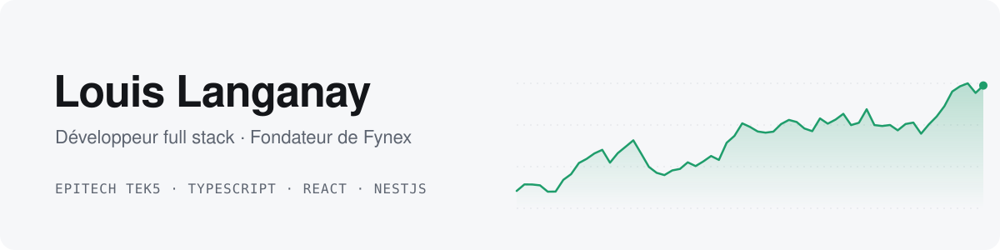

<picture>
  <source media="(prefers-color-scheme: dark)" srcset="assets/banner-dark.svg">
  
</picture>

  <a href="https://louisl.me">louisl.me</a> ·
  <a href="https://fynexapp.com">fynexapp.com</a> ·
  <a href="https://linkedin.com/in/louis-langanay">LinkedIn</a> ·
  <a href="https://x.com/louislanganay">X</a>

### En ce moment

**[Fynex](https://fynexapp.com)**, l'outil de suivi des investisseurs qui gèrent eux-mêmes leurs actions : portefeuille consolidé, dividendes, fiche de chaque titre, analyse par IA. Je le construis avec une petite équipe, en React, NestJS et PostgreSQL.

Je code aujourd'hui surtout en pilotant des agents (Claude Code) : moins de temps à taper, plus à décider quoi construire et à relire ce qui part en production.

### Projets

| | |
|---|---|
| **[drop](https://github.com/LouisLanganay/drop)** Les lampes Hue suivent la musique en temps réel, depuis le micro du téléphone : tempo, montées, drops. Kotlin · Android · DTLS · traitement du signal | **[claude-gmail-channel](https://github.com/LouisLanganay/claude-gmail-channel)** Plugin Claude Code qui fait arriver chaque nouvel email dans une session en cours. TypeScript · MCP · Bun |
| **[commit-ai-generator](https://github.com/LouisLanganay/commit-ai-generator)** Extension VS Code qui rédige le message de commit à partir du diff. TypeScript · VS Code API · OpenAI | **[AREA](https://github.com/LouisLanganay/AREA)** Automatisations entre services, façon Zapier, avec éditeur de workflows. TypeScript · NestJS · React · projet d'équipe |
| **[Zombie Quarter Rampage](https://github.com/LouisLanganay/Zombie-Quarter-Rampage-my_rpg)** RPG en C inspiré de la série U4 et de The Last of Us. C · CSFML | **[Raytracer](https://github.com/LouisLanganay/Raytracer)** Moteur de rendu par lancer de rayons. Your CPU goes brrrrr. C++ |

### Stack

  

