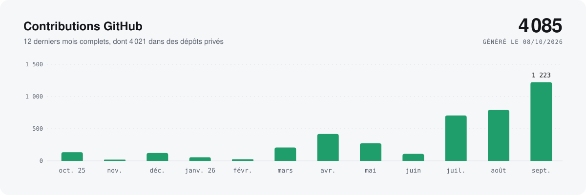
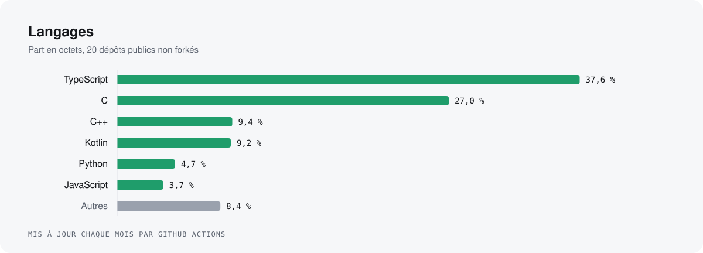
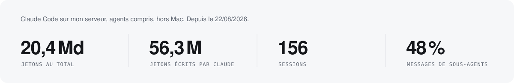
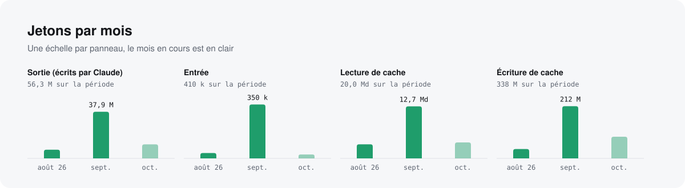
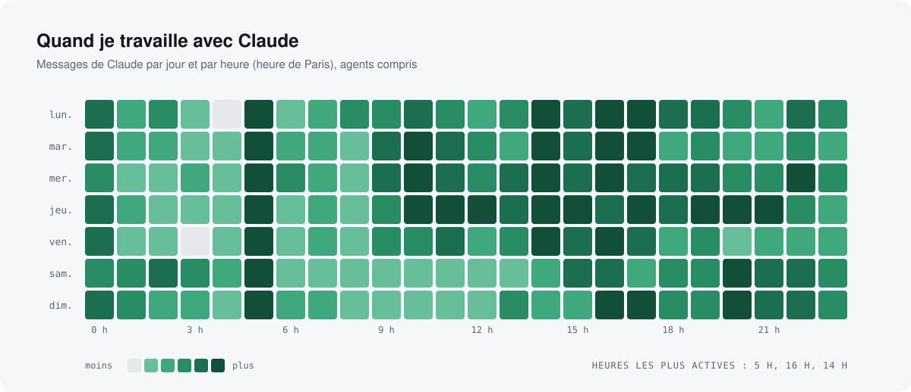

<picture>
  <source media="(prefers-color-scheme: dark)" srcset="assets/banner-dark.svg">
  
</picture>

<p align="center">
  <a href="https://louisl.me">louisl.me</a> ·
  <a href="https://fynexapp.com">fynexapp.com</a> ·
  <a href="https://linkedin.com/in/louis-langanay">LinkedIn</a> ·
  <a href="https://x.com/louislanganay">X</a>
</p>

### En ce moment

**[Fynex](https://fynexapp.com)**, l'outil de suivi des investisseurs qui gèrent eux-mêmes leurs actions : portefeuille consolidé, dividendes, fiche de chaque titre, analyse par IA. Je le construis avec une petite équipe, en React, NestJS et PostgreSQL.

Je code aujourd'hui surtout en pilotant des agents (Claude Code) : moins de temps à taper, plus à décider quoi construire et à relire ce qui part en production.

### Nightshift

**[Nightshift](https://nightshift.louisl.me)**, un coéquipier IA autonome qui gère les opérations d'un projet pendant la nuit : il exécute les tâches en file, tient le board à jour, relit les pull requests et envoie un rapport chaque matin.

Il est né de mon propre assistant, qui tourne chaque nuit sur le projet Fynex. J'en ai fait un produit pour les équipes qui veulent la même chose.

### En chiffres

<picture>
  <source media="(prefers-color-scheme: dark)" srcset="assets/stats-dark.svg">
  
</picture>

<picture>
  <source media="(prefers-color-scheme: dark)" srcset="assets/activity-dark.svg">
  
</picture>

<picture>
  <source media="(prefers-color-scheme: dark)" srcset="assets/languages-dark.svg">
  
</picture>

### Avec Claude

Je code surtout en pilotant Claude Code, et mon assistant tourne aussi seul la nuit. Ces chiffres sortent des transcripts de mon serveur : agents et sous-agents compris, sessions sur mon Mac non comptées.

<picture>
  <source media="(prefers-color-scheme: dark)" srcset="assets/claude-key-dark.svg">
  
</picture>

<picture>
  <source media="(prefers-color-scheme: dark)" srcset="assets/claude-tokens-dark.svg">
  
</picture>

<picture>
  <source media="(prefers-color-scheme: dark)" srcset="assets/claude-heatmap-dark.svg">
  
</picture>

### Mes stats en JSON

Les mêmes chiffres, régénérés chaque mois, sont servis en JSON (CORS ouvert) :

```sh
curl -s https://raw.githubusercontent.com/LouisLanganay/LouisLanganay/main/stats.json
curl -s https://raw.githubusercontent.com/LouisLanganay/LouisLanganay/main/claude-stats.json
```

- `stats.json` (`schema_version: 1`, GitHub Actions) : `generated_at` (ISO 8601, UTC), `profile`, `totals` (dépôts publics, étoiles, contributions sur 12 mois), `contributions` (12 derniers mois complets, total public et privé par mois), `languages` (part en octets des dépôts publics non forkés), `featured_repos` (nom, description, étoiles, langage). Les contributions privées ne sont que les comptes agrégés déjà visibles sur le profil, aucun dépôt privé n'est nommé.
- `claude-stats.json` (`schema_version: 1`, calculé sur mon serveur) : `generated_at`, `period`, `totals` (jetons par type, messages, sessions, sous-agents, part des sous-agents), `months` (jetons, messages, sessions et sous-agents par mois), `heatmap` (messages par jour et par heure, heure de Paris), `models`. Que des agrégats : aucun contenu, projet ni session.

### Projets

| | |
|---|---|
| **[drop](https://github.com/LouisLanganay/drop)**<br>Les lampes Hue suivent la musique en temps réel, depuis le micro du téléphone : tempo, montées, drops.<br><sub>Kotlin · Android · DTLS · traitement du signal</sub> | **[claude-gmail-channel](https://github.com/LouisLanganay/claude-gmail-channel)**<br>Plugin Claude Code qui fait arriver chaque nouvel email dans une session en cours.<br><sub>TypeScript · MCP · Bun</sub> |
| **[commit-ai-generator](https://github.com/LouisLanganay/commit-ai-generator)**<br>Extension VS Code qui rédige le message de commit à partir du diff.<br><sub>TypeScript · VS Code API · OpenAI</sub> | **[AREA](https://github.com/LouisLanganay/AREA)**<br>Automatisations entre services, façon Zapier, avec éditeur de workflows.<br><sub>TypeScript · NestJS · React · projet d'équipe</sub> |
| **[Zombie Quarter Rampage](https://github.com/LouisLanganay/Zombie-Quarter-Rampage-my_rpg)**<br>RPG en C inspiré de la série U4 et de The Last of Us.<br><sub>C · CSFML</sub> | **[Raytracer](https://github.com/LouisLanganay/Raytracer)**<br>Moteur de rendu par lancer de rayons. Your CPU goes brrrrr.<br><sub>C++</sub> |

### Stack

<p>
  
</p>
